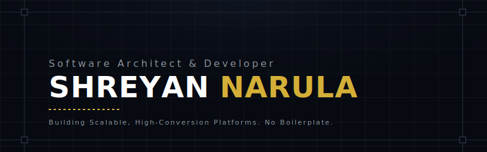

  

 

  <em style="color: #8B949E; font-size: 16px;">Specializing in Zero-Knowledge Architecture, Full-Stack Optimization, and Premium Digital Experiences.</em>

  

## ❖ The Core Focus

Currently scaling **[Ventlr](#)**, a zero-knowledge campus platform designed for absolute anonymity and unfiltered truth. Moving away from boilerplate MVPs and focusing on high-performance, edge-deployed architectures.

---

## ❖ Selected Work

<table width="100%">
  <tr>
    <td width="50%" valign="top">
      <h3><a href="#">Ventlr</a></h3>
      
<b>The Anonymous Campus Network</b> 
      A zero-knowledge proof based platform that guarantees absolute anonymity for students. Built with Next.js, Postgres, and advanced cryptographic flows.

      <em>Stack: Next.js, Tailwind, ZK-Proofs, PostgreSQL</em>
    </td>
    <td width="50%" valign="top">
      <h3><a href="#">GetHiredInX</a></h3>
      
<b>Accelerated Career Engine</b> 
      An algorithmic platform connecting top talent with high-growth startups. Optimized for massive throughput and sub-100ms response times.

      <em>Stack: React, Node.js, Redis, AWS</em>
    </td>
  </tr>
  <tr>
    <td width="50%" valign="top">
      <h3><a href="#">GetSponsoredJob</a></h3>
      
<b>Global Mobility Platform</b> 
      A highly complex data pipeline aggregating and validating visa-sponsoring employers worldwide.

      <em>Stack: Python, FastAPI, Docker, MongoDB</em>
    </td>
    <td width="50%" valign="top">
      <h3><a href="#">Situation First</a></h3>
      
<b>Real-time Crisis Management</b> 
      An event-driven architecture designed to handle massive concurrent websocket connections for emergency tracking.

      <em>Stack: Go, WebSockets, React, Kubernetes</em>
    </td>
  </tr>
</table>

 

## ❖ The Stack & Philosophy

I don't just use frameworks; I understand the primitives underneath them. I build systems that are as mathematically sound on the backend as they are visually stunning on the frontend.

*   **Languages:** TypeScript, Python, SQL, GraphQL
*   **Architecture:** Zero-Knowledge Proofs, Event-Driven Microservices, Serverless Edge
*   **Design:** Deep expertise in bespoke UI/UX, 'Midnight Prestige' aesthetic, and advanced animations.

  

  <a href="https://shreyannarula.com"><b>Portfolio</b></a> &nbsp; ✦ &nbsp;
  <a href="https://linkedin.com/in/shreyannarula"><b>LinkedIn</b></a> &nbsp; ✦ &nbsp;
  <a href="mailto:your.email@example.com"><b>Contact</b></a>

